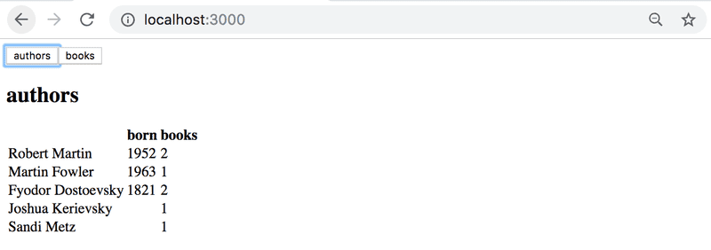
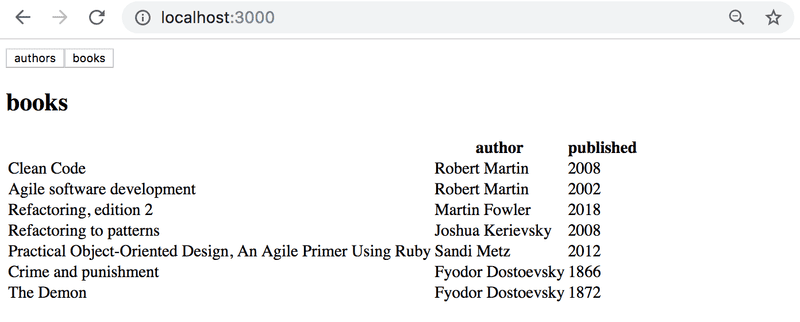
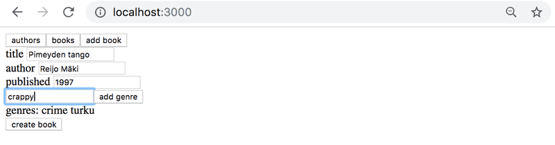
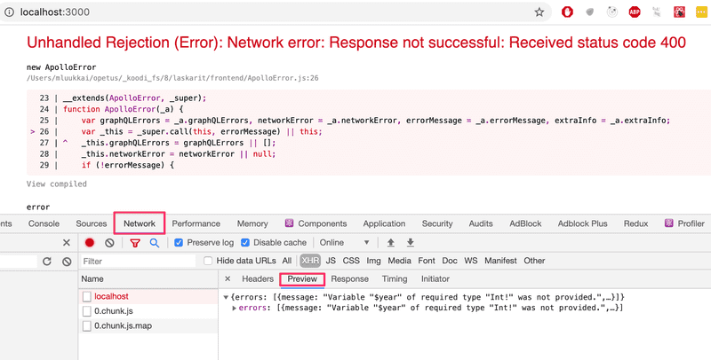

# Exercises 8.8.-8.12

Through these exercises, we'll implement a frontend for the GraphQL library.

Take [this project](https://github.com/fullstack-hy2020/library-frontend) as a start for your application.

Note if you want, you can also use [React router](https://fullstackopen.com/en/part7/react_router) to implement the application's navigation!

## 8.8: Authors view

Implement an Authors view to show the details of all authors on a page as follows:

## 8.9: Books view

Implement a Books view to show on a page all other details of all books except their genres.

## 8.10: Adding a book

Implement a possibility to add new books to your application. The functionality can look like this:

Make sure that the Authors and Books views are kept up to date after a new book is added.

In case of problems when making queries or mutations, check from the developer console what the server response is:

