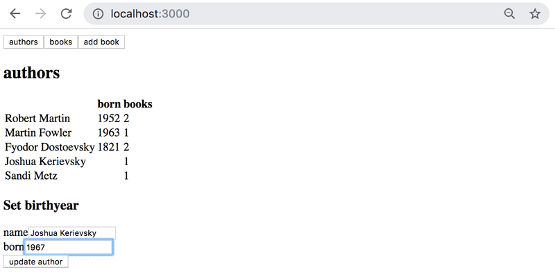
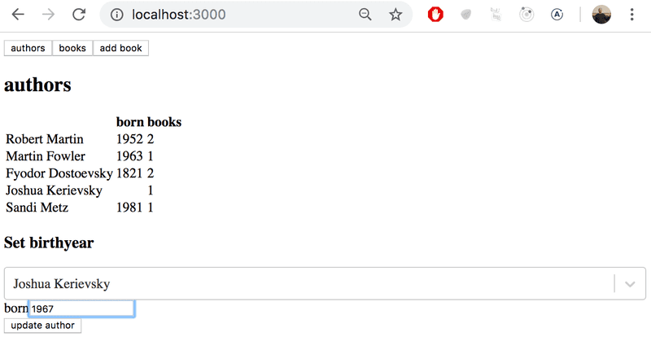
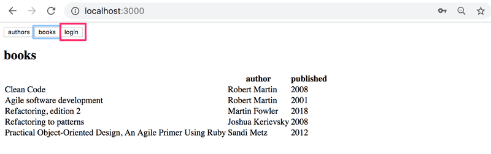
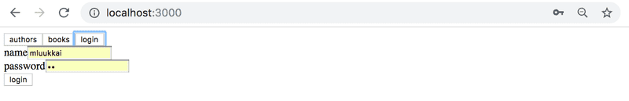
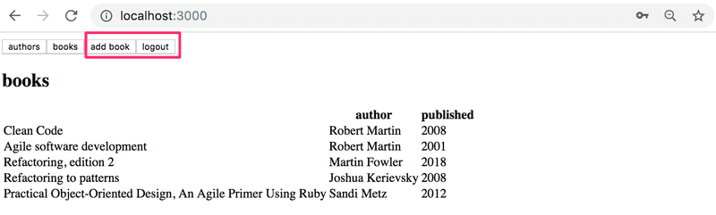

# Exercises 8.8.-8.12

Through these exercises, we'll implement a frontend for the GraphQL library.

Take [this project](https://github.com/fullstack-hy2020/library-frontend) as a start for your application.

Note if you want, you can also use [React router](https://fullstackopen.com/en/part7/react_router) to implement the application's navigation!

## 8.8: Authors view

Implement an Authors view to show the details of all authors on a page as follows:

## 8.9: Books view

Implement a Books view to show on a page all other details of all books except their genres.

## 8.10: Adding a book

Implement a possibility to add new books to your application. The functionality can look like this:

Make sure that the Authors and Books views are kept up to date after a new book is added.

In case of problems when making queries or mutations, check from the developer console what the server response is:

## 8.11: Authors birth year

Implement a possibility to set authors birth year. You can create a new view for setting the birth year, or place it on the Authors view:

Make sure that the Authors view is kept up to date after setting a birth year.

## 8.12: Authors birth year advanced

Change the birth year form so that a birth year can be set only for an existing author. Use [select tag](https://react.dev/reference/react-dom/components/select), [react select](https://github.com/JedWatson/react-select), or some other mechanism.

A solution using the react select library looks as follows:

## Exercises 8.17.-8.22

### 8.17 Listing books

After the backend changes, the list of books does not work anymore. Fix it.

### 8.18 Log in

Adding new books and changing the birth year of an author do not work because they require a user to be logged in.

Implement login functionality and fix the mutations.

It is not necessary yet to handle validation errors.

You can decide how the login looks on the user interface. One possible solution is to make the login form into a separate view which can be accessed through a navigation menu:

The login form:

When a user is logged in, the navigation changes to show the functionalities which can only be done by a logged-in user:

